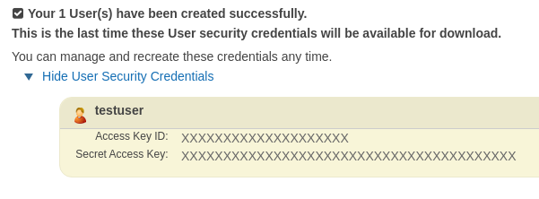
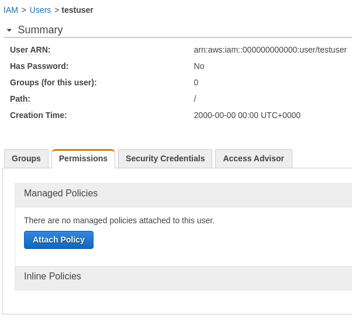

# ActiveSMS::Backend::AWS
[](https://travis-ci.org/Fedcomp/active_sms-backend-aws)

ActiveSMS backend to send sms using [Amazon Web Services](https://aws.amazon.com).
**At this point gem does not support SenderID**. If you know how to specify it - open issue or make pull request, all contributions are welcome!

## Before installation - obtaining token

Before you can use this gem, you should get tokens from amazon web services (AWS).
Here are steps to achieve that:

1. Go to [AWS registration page](https://goo.gl/HG8Y9s)
2. After you registered and logged in, go to [IAM users](https://goo.gl/u4hrzj)
3. Click "Create new users", enter username of your wish (in my case `testuser`) and then click "Create".
4. You should see similar picture:

   

   save **access key id** and **secret acces key** somwhere.
5. Now close popup and click on the user.
6. Click **Permissions** tab. It will look like this

   

7. Click on **Attach Policy**, then filter by **SNS**.
8. Check **AmazonSNSFullAccess**, click **Attach Policy** (at the bottom)

This is simple example on how to get them and make things work quick.
In reality AWS support various access options,
you may read them [here](https://goo.gl/sajJgL) and configure it more strict or closer to your needs.

## Installation & usage

Add this line to your application's Gemfile:

```ruby
gem "active_sms-backend-aws"
```

Then somewhere in your initialization code:

```ruby
require "active_sms"
require "active_sms-backend-aws"

ActiveSMS.configure do |c|
  c.register_backend(:my_main_backend,
    ActiveSMS::Backend::AWS,
    access_key: ENV["AWS_ACCESS_KEY"],
    secret_access_key: ENV["AWS_SECRET_ACCESS_KEY"],
    region: ENV["AWS_REGION"] # Optional, default will be "us-east-1"
  )

  c.default_backend = :my_main_backend
end
```
This is an simple example of configuration.
Before running application you should specify
`AWS_ACCESS_KEY`, `AWS_SECRET_ACCESS_KEY` and `AWS_REGION`
environment variables.
You may change initializer code to suit your needs more,
just make sure **you never store credentials commited to your codebase**.
It should be stored separately from application.

Now, whenever you need to send SMS, just do:

```ruby
# Will immediately send sms
ActiveSMS.send_sms("+10000000000", "My sms text")
```

For more advanced usage please
go to [ActiveSMS documentation](https://github.com/Fedcomp/active_sms#real-life-example)

## Contributing

Bug reports and pull requests are welcome on GitHub at https://github.com/Fedcomp/active_sms-backend-aws.

## License

The gem is available as open source under the terms of the [MIT License](http://opensource.org/licenses/MIT).
